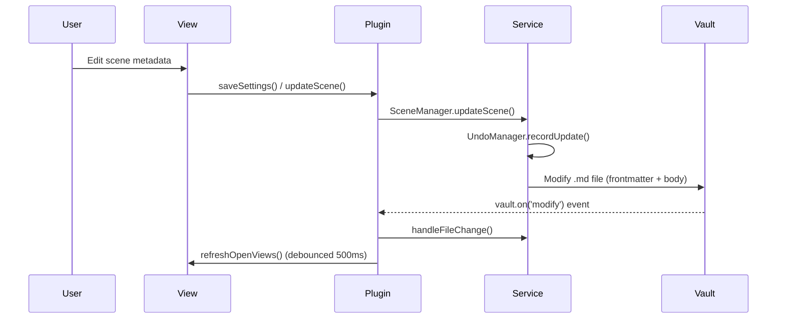
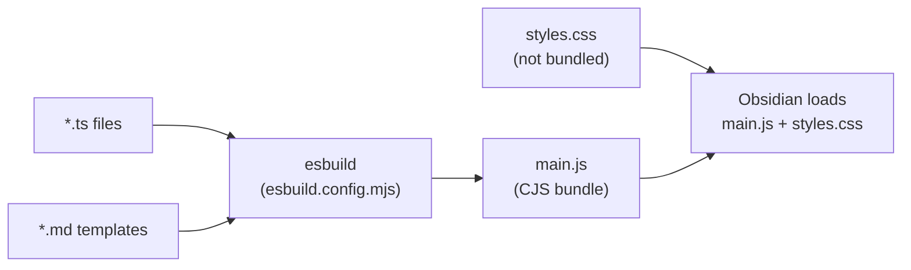

# Architecture

## Overview

StoryLine is a single-file Obsidian plugin (`main.ts` -> `main.js`) written in TypeScript. It transforms an Obsidian vault into a book planning and writing tool with 17 views, multiple entity managers, and per-project data stored as Markdown + YAML frontmatter.

## System Architecture

```mermaid
graph TB
    subgraph "Obsidian Runtime"
        API["Obsidian API<br/>(external)"]
        CM["CodeMirror 6<br/>(external)"]
        EL["Electron<br/>(desktop only)"]
    end

    subgraph "Plugin Entry"
        MAIN["main.ts<br/>SceneCardsPlugin<br/>(extends Plugin)"]
    end

    subgraph "Views (17)"
        BOARD["BoardView"]
        TIMELINE["TimelineView"]
        PLOTGRID["PlotgridView"]
        STORYLINE["StorylineView"]
        CHARACTER["CharacterView"]
        STATS["StatsView"]
        LOCATION["LocationView"]
        CODEX["CodexView"]
        MANUSCRIPT["ManuscriptView"]
        NAVIGATOR["NavigatorView"]
        INSPECTOR["SceneInspectorView"]
        RESEARCH["ResearchView"]
        NOTES["NotesView"]
        SYNOPSIS["SynopsisView"]
        DETAILS["DetailsView"]
        HELP["HelpView"]
        DNVIEW["DynamicNarrativeView"]
    end

    subgraph "Services"
        SM["SceneManager"]
        CM2["CharacterManager"]
        LM["LocationManager"]
        CDM["CodexManager"]
        RM["ResearchManager"]
        LS["LinkScanner"]
        ES["ExportService"]
        SM2["SeriesManager"]
        UM["UndoManager"]
        SQS["SceneQueryService"]
        FT["FieldTemplateService"]
        CR["CascadeRenameService"]
        WT["WritingTracker"]
        SNAP["SnapshotManager"]
        VS["ViewSnapshotService"]
        VAL["Validator"]
        DNM["DynamicNarrativeManager"]
    end

    subgraph "Data Layer"
        VAULT["Vault (Markdown + YAML)"]
        SYS["System/ (JSON)"]
        SERIES["series.json"]
        DNDATA["DynamicNarrative/"]
    end

    API --> MAIN
    CM --> MAIN
    EL -.-> MAIN

    MAIN --> BOARD & TIMELINE & PLOTGRID & STORYLINE
    MAIN --> CHARACTER & STATS & LOCATION & CODEX
    MAIN --> MANUSCRIPT & NAVIGATOR & INSPECTOR
    MAIN --> RESEARCH & NOTES & SYNOPSIS & DETAILS & HELP
    MAIN --> DNVIEW

    MAIN --> SM & CM2 & LM & CDM & RM
    MAIN --> LS & SM2 & FT & CR & WT & VS
    MAIN --> DNM

    SM --> UM & SQS
    SM --> VAULT
    CM2 --> VAULT
    LM --> VAULT
    CDM --> VAULT
    RM --> VAULT
    DNM --> VAULT
    DNM --> DNDATA
    SM2 --> SERIES
    SM --> SYS
    WT --> SYS
    VS --> SYS
    DNM --> SYS
```



## Data Flow



## Build Pipeline



## Key Design Decisions

### Single Bundle
Everything compiles to one `main.js` file. Obsidian's plugin system requires a single CJS entry point. `obsidian`, `electron`, and `@codemirror/*` are marked external and provided by the runtime.

### Markdown as Database
All entity data (scenes, characters, locations, codex entries, research posts) is stored as Markdown files with YAML frontmatter. This keeps data portable and editable outside the plugin.

### Per-Project System/ Folder
Runtime state that doesn't belong in user-facing Markdown (tag colors, aliases, filter presets, writing stats, corkboard positions, view snapshots) is stored as JSON files in a `System/` subfolder per project. This was migrated from Obsidian's `data.json` to support multi-project and series workflows.

### Debounced File Watchers
Vault file events (`modify`, `delete`, `rename`) trigger a debounced `refreshOpenViews()` (500ms) to batch rapid edits into a single re-render. The file watchers in `main.ts` filter out writes to the project's `System/` folder to prevent feedback loops from the plugin's own JSON writes. The DynamicNarrativeManager also hooks into `delete` and `rename` events to keep its in-memory maps and wikilinks synchronized.

### Dynamic Narrative Isolation
All Dynamic Narrative code lives in the `dynamic-narrative/` directory. Only 6 shared files are modified (`constants.ts`, `main.ts`, `settings.ts`, `styles.css`, `components/ViewSwitcher.ts`, `services/SceneManager.ts`). Entity data is stored as Markdown files with YAML frontmatter in `DynamicNarrative/{Scenarios,Objectives,Arcs,Quests}/` and in-memory state is persisted to `System/dynamic-narrative.json`. The manager uses a promise-chain mutex for serialized writes to prevent race conditions.

### ESLint Suppression Pattern
Every `.ts` file starts with a file-wide `eslint-disable` block. This is intentional and documented in AGENTS.md. The Obsidian API surface and several untyped third-party libraries require dynamic dispatch patterns that trigger TypeScript safety rules.

## Folder Structure (Vault Side)

```
StoryLine/                          <- configurable root folder
  My Novel.md                       <- project file (Markdown + YAML)
  My Novel/
    Scenes/                         <- scene files
    Notes/                          <- corkboard sticky notes
    Archive/                        <- archived scenes
    Research/                       <- research posts
    SceneNotes/                     <- external per-scene notes
    Codex/
      Characters/                   <- character profiles
      Locations/                    <- world + location profiles
      [Custom]/                     <- user-defined codex categories
    System/
      tag-colors.json
      aliases.json
      filter-presets.json
      stats.json
      board.json
      field-templates.json
      codex-digests.json
      plotgrid.json
      dynamic-narrative.json
      Snapshots/
    DynamicNarrative/
      Scenarios/                  <- scenario entity files
      Objectives/                 <- objective entity files
      Arcs/                       <- arc entity files
      Quests/                     <- quest entity files
    Exports/
```

### Series Structure

```
StoryLine/
  My Series/
    series.json                     <- SeriesMetadata
    Codex/                          <- shared across all books
      Characters/
      Locations/
    Book One.md
    Book One/
      Scenes/
      System/
    Book Two.md
    Book Two/
      Scenes/
      System/
```
